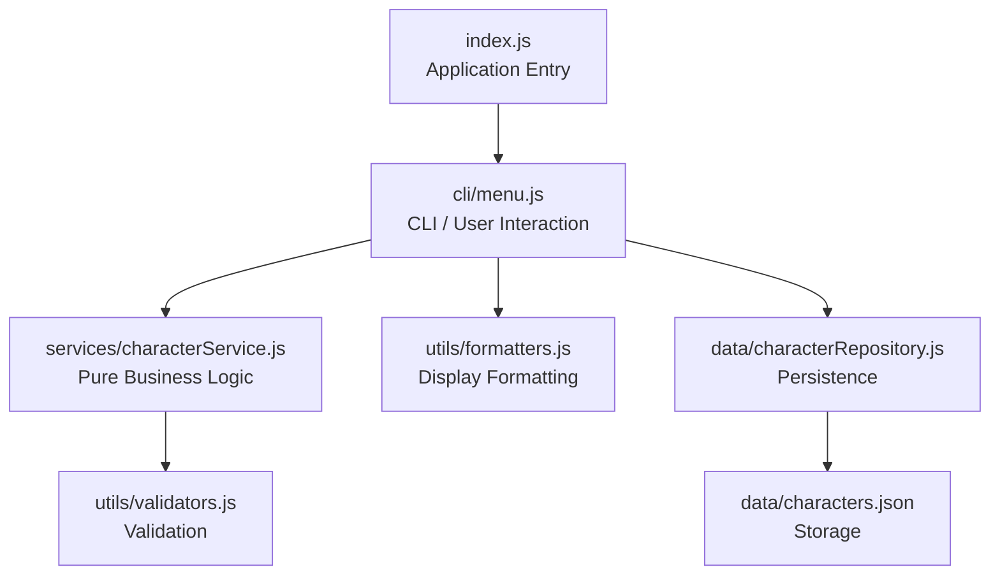
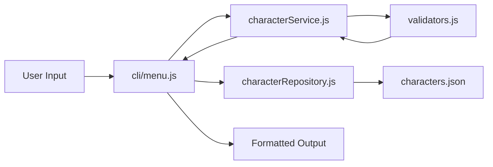

# ⚔ Final Fantasy XIII --- Character Database Viewer


A terminal-only Node.js application for managing Final Fantasy XIII
characters.\
The project is intentionally designed to demonstrate **Functional
Programming in JavaScript** through pure functions, immutable updates,
higher-order functions, closures, recursion, and clean architectural
separation.

------------------------------------------------------------------------

## Setup

### Requirements

-   Node.js \>= 16

### Start the application

``` bash
node index.js
```

Or:

``` bash
npm start
```

------------------------------------------------------------------------

## Features

  Key   Feature
  ----- ------------------------
  `1`   List all characters
  `2`   View character detail
  `3`   Add a new character
  `4`   Edit a character
  `5`   Delete a character
  `6`   Filter by Primary Role
  `7`   Role statistics
  `0`   Exit

All changes are automatically persisted in:

    data/characters.json

------------------------------------------------------------------------

## Project Structure

    index.js                      ← launcher only
    cli/
      menu.js                     ← CLI boundary: input/output orchestration
    data/
      characters.json             ← persistent JSON storage
      characterRepository.js      ← file I/O only
    services/
      characterService.js         ← pure business logic
    utils/
      validators.js               ← pure validation functions
      formatters.js               ← pure display/string functions
      lazy.js                     ← lazy evaluation helpers via generators
      either.js                   ← functional error handling with Left/Right

------------------------------------------------------------------------

---

## Architecture Overview

The application follows a layered architecture with clear separation of concerns and isolated side effects.

- **index.js (Entry Layer)**  
  Starts the application and calls the CLI.

- **cli/menu.js (Interaction Layer)**  
  Handles all user input/output via the terminal, manages application state during runtime, and orchestrates calls to services and persistence.

- **services/characterService.js (Business Logic Layer)**  
  Contains pure functions for all core operations such as adding, updating, deleting, filtering, sorting, and computing statistics.

- **utils/validators.js (Validation Layer)**  
  Ensures that all character data follows defined rules before being processed.

- **utils/formatters.js (Formatting Layer)**  
  Prepares data for display in the terminal (lists, details, messages).

- **data/characterRepository.js (Persistence Layer)**  
  Handles reading from and writing to the JSON file.

- **data/characters.json (Storage)**  
  Persistent storage of all character data.

This structure ensures that business logic remains pure while side effects (I/O, console interaction) are isolated.

---

## Application Data Flow

### On Startup
1. The application starts via `index.js`
2. The CLI loads data using the repository
3. Data is read from `characters.json`
4. The data is stored in memory
5. The menu is displayed

### Read Operations (View, Filter, Statistics)
1. User selects an option
2. CLI accesses in-memory data
3. Service functions process the data if needed
4. Formatters prepare output
5. Result is displayed in the terminal

### Write Operations (Add, Edit, Delete)
1. User inputs data via CLI
2. CLI sends data to service layer
3. Service validates data using validators
4. If valid, a new updated state is returned
5. CLI updates in-memory state
6. Repository persists the new state to `characters.json`
7. CLI displays success or error message

---

## Architecture Diagram



---

## Data Flow Diagram



### Functional Programming Design Choices

#### 1. Pure Functions & No Side Effects

Pure business logic lives in: - `characterService.js` -
`validators.js` - `formatters.js`

These modules: - do not log - do not read or write files - do not mutate
input arguments - produce deterministic outputs

Side effects are isolated to: - `cli/menu.js` -
`characterRepository.js` - `index.js`

#### 2. Immutability

The project avoids mutating arrays and objects directly: - `map` is used
for updates - `filter` is used for deletions - spread syntax is used for
object and array copies - reducers build new accumulator objects instead
of mutating old ones

#### 3. Higher-Order Functions

The project uses: - `map` - `filter` - `reduce` - `flatMap` - custom
higher-order functions such as formatter factories and validator
builders

#### 4. Function Composition

Complex tasks are built from smaller reusable functions: - validation is
composed from smaller validators - formatting is composed from field
formatters and line builders - service operations are composed from
small transformation helpers

#### 5. Closures and Recursion

The project demonstrates JavaScript FP techniques through:

- **closures**
  - `createRoleFilter`
  - ANSI formatter factories
  - CLI prompt factories
  - validator builders

- **recursion**
  - recursive menu loop (`runMenu`)
  - recursive field collection in the CLI
  - recursive character lookup (`findCharacterById`)
  - recursive role statistics computation (`getRoleStats`)

#### 6. Type Safety in JavaScript

Task Replace with Lazy Evaluation. For more Information read 7. Lazy Evaluation

#### 7. Lazy Evaluation

The project also demonstrates lazy evaluation through JavaScript generator-based pipelines.

A dedicated utility module (`utils/lazy.js`) provides:

- `lazyFilter`
- `lazyMap`
- `toArray`

These functions allow character data to be processed lazily and only evaluated when the final result is needed. Lazy evaluation is used in the service layer for role-based filtering and in the formatting layer for display transformation pipelines.

This adds an additional functional programming concept from theory without changing the external behavior of the application.

#### 8. Functional Error Handling with Either

The project also demonstrates functional error handling using an `Either` abstraction.

A dedicated utility module (`utils/either.js`) provides:

- `Right(value)` for successful computations
- `Left(error)` for failures with explicit error information
- `orElse(...)` for conditional recovery

This avoids relying on exceptions or `null` values and keeps functions pure by always returning a single explicit value. In the service layer, character lookup can be expressed as `findCharacterByIdEither`, which returns either `Right(character)` or `Left(errorMessage)`.

------------------------------------------------------------------------

## Testing

### Automated Test Coverage

The following modules are covered by automated unit tests:

- `utils/validators.js`
  - validation of required fields
  - age validation
  - role validation
  - valid vs invalid character inputs

- `services/characterService.js`
  - add, update, delete operations
  - immutability (no mutation of original data)
  - filtering, sorting, and statistics
  - ID generation

- `data/characterRepository.js`
  - loading characters from JSON
  - handling invalid or missing files
  - normalization of persisted data
  - saving valid data to disk

- `utils/lazy.js`
  - lazy filtering
  - lazy mapping
  - pipeline composition
  - deferred evaluation until materialization

- `utils/either.js`
  - `Right` / `Left` construction
  - success and failure checks
  - mapping over successful values
  - conditional recovery with `orElse`
  - integration with character lookup

All tests ensure deterministic behavior and validate the functional programming principles used in the project.

### How to test

#### Run automated tests

```bash
npm test
```

This executes all unit tests located in the `test/` directory using Node's built-in test runner.

#### Run the application manually

```bash
npm start
```

Manual testing through the CLI can be used in addition to automated tests to verify user interaction and overall application flow.

### Expected outcomes

-   no crashes during valid flows
-   invalid input produces readable errors
-   successful create/update/delete actions persist to `characters.json`
-   business logic remains deterministic and side‑effect free outside
    the CLI and repository layers

------------------------------------------------------------------------

## Preloaded Characters

  Name                Role
  ------------------- -----------
  Lightning           Commando
  Snow Villiers       Sentinel
  Oerba Dia Vanille   Saboteur
  Sazh Katzroy        Synergist
  Hope Estheim        Ravager
  Oerba Yun Fang      Commando

------------------------------------------------------------------------

## Summary

This project highlights functional programming strengths through:
- pure business logic
- immutable updates
- higher-order functions
- function composition
- closures
- recursion
- lazy evaluation
- clear separation of I/O and core logic


